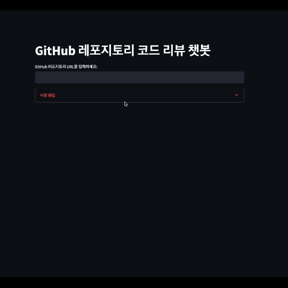

# [6주차] 심화과제: LangChain과 Streamlit으로 자신만의 LLM 서비스 구현

## 목표

---

이 프로젝트는 GitHub 레포지토리 코드 리뷰 챗봇을 구현하는 것이 목표입니다. 사용자가 GitHub 레포지토리 주소를 입력하면 해당 레포지토리의 코드를 분석하여 잘한 점과 개선할 점을 평가합니다.

### 주요 기능

- [ ] GitHub 레포지토리 URL 입력 받기
    - Streamlit의 text input을 사용하여 사용자로부터 GitHub 레포지토리 URL을 입력받습니다.
    - 입력된 URL이 유효한 GitHub 레포지토리 주소인지 검증합니다.

- [ ] 레포지토리 코드 분석
    - GitHub API를 사용하여 레포지토리의 코드를 가져옵니다.
    - 주요 파일들의 내용을 읽어와 분석합니다.
    - 코드의 구조, 패턴, 스타일 등을 파악합니다.

- [ ] GPT를 활용한 코드 리뷰
    - LangChain을 사용하여 GPT에게 코드 리뷰를 요청합니다.
    - 다음 항목들을 평가하도록 합니다:
        1. 코드의 잘된 점
            - 코드 구조
            - 네이밍 컨벤션
            - 모듈화/재사용성
            - 문서화
        2. 개선이 필요한 점
            - 잠재적인 버그
            - 성능 이슈
            - 보안 취약점
            - 코드 스타일 개선사항

- [ ] 리뷰 결과 표시
    - 분석 결과를 보기 좋게 정리하여 표시합니다.
    - 잘된 점과 개선점을 구분하여 명확하게 보여줍니다.
    - 필요한 경우 코드 예시와 함께 구체적인 개선 방안을 제시합니다.

### 구현 시 참고사항

1. GitHub API 사용
    - GitHub API를 통해 레포지토리 접근 시 인증 토큰 필요
    - API 호출 제한에 유의

2. 대용량 코드 처리
    - 큰 레포지토리의 경우 모든 코드를 한 번에 처리하기 어려울 수 있음
    - 중요 파일 위주로 분석하거나 청크 단위로 처리하는 전략 필요

3. 사용자 경험
    - 분석 중임을 알리는 로딩 표시 필요
    - 에러 발생 시 적절한 메시지 표시
    - 결과를 이해하기 쉽게 구조화하여 표시

## Prompts

- [initial_prompt](prompts.py)
    - 코드 분석 요청
    - 개선방안에 대한 구체적인 코드 예제 제공

- [with_links_prompt](prompts.py)
    - 코드 분석 요청 + 관련 파일 링크 포함
    - 개선방안에 대한 간단한 문장 제공

- [score_prompt](prompts.py)
    - 코드 분석 요청 + 점수 산정 요청
    - 점수화를 통해 openai를 평가지표로 사용할 수 있음

### 현재 방식의 한계

- 코드 분석 시 모든 파일을 prompt에 포함하여 사용하고 있기 때문에, 대규모 repository의 경우 프롬프트 크기 제한에 걸릴 수 있음


## Vector DB 활용

- 코드 분석 시 모든 파일을 prompt에 포함하여 사용하고 있기 때문에, 대규모 repository의 경우 프롬프트 크기 제한에 걸릴 수 있음
- 따라서, 벡터 DB를 활용하여 코드 분석 결과를 저장하고, 이를 통해 코드 분석을 수행하는 방식으로 개선

### 결과

- 해당 레포지터리에 대한 질의응답을 할 수 있어졌지만
- 초기 분석 결과의 질이 떨어짐

```
초기 코드 리뷰 결과
프로젝트 개요:
이 프로젝트는 선생님 채용 정보를 제공하는 앱으로, 사용자가 선택한 학교급과 지역에 따라 공고를 조회할 수 있습니다.
상세 평가:
A. 코드 품질 (40점)

코드 구조 및 설계 (10점):

코드는 main.dart에서 시작하여 위젯과 모델 클래스들로 구성되어 있습니다.
Provider 패턴을 사용하여 데이터 관리를 구현하고 있습니다.
모듈간의 의존성을 최소화하기 위해 상태 관리가 필요한 모듈에만 Provider를 적용하고 있습니다.
기능적으로 필요한 구조와 코드가 모두 포함되어 있습니다.
가독성 및 네이밍 (10점):

변수, 함수, 클래스 등에 의미있고 명확한 네이밍을 사용하고 있습니다.
코드의 가독성이 좋으며, 필요한 주석도 적절히 작성되어 있습니다.
모듈화/재사용성 (10점):

코드는 모듈화되어 있으며, 필요한 기능들이 위젯들로 재사용 가능하도록 구성되어 있습니다.
모듈 간의 의존성을 최소화하고 있어서 코드의 재사용성이 높습니다.
에러 처리 (10점):

코드에 명시적인 에러 처리가 없습니다.
예외 상황에 대한 처리와 에러 핸들링이 추가되면 더욱 안정적인 앱이 될 수 있을 것입니다.
B. 문서화 (20점)

README 완성도 (10점):

README가 비어 있습니다. 프로젝트의 개요, 설치 및 실행 방법, 사용 예제, 라이선스 등을 포함하는 온전한 README 작성이 필요합니다.
코드 주석 (10점):

코드에 주석이 거의 없습니다. 주석을 추가하여 코드의 의도와 동작을 명확하게 설명하는 것이 좋을 것입니다.
C. 보안 및 성능 (20점)

보안 취약점 (10점):

코드상에 보안 취약점은 보이지 않습니다. 하지만 네트워크 요청 등의 보안 문제에 대한 처리는 추가될 필요가 있습니다.
성능 최적화 (10점):

코드에서 큰 성능 문제는 보이지 않습니다. 그러나 UI나 데이터 로딩 속도 등의 성능을 개선하기 위한 최적화 작업이 필요할 수 있습니다.
D. 프로젝트 완성도 (20점)

기능 구현 완성도 (10점):

기본적인 기능인 학교급과 지역 선택에 따른 채용 공고 조회가 구현되어 있습니다.
하지만 공고 조회 결과가 없는 경우에 대한 처리가 추가되면 좋을 것입니다.
테스트 커버리지 (10점):

주어진 코드에서는 테스트 코드가 없으므로 테스트 커버리지를 평가할 수 없습니다.
총점 및 등급:
총점: 70점
등급: C
개선 제안:
README 완성도 개선: 프로젝트의 개요, 설치 및 실행 방법, 사용 예제, 라이선스 등을 포함하는 온전한 README를 작성해주세요. (링크)
주석 추가: 코드에 주석을 추가하여 코드의 의도와 동작을 명확하게 설명해주세요.
보안 취약점 강화: 필요한 경우 네트워크 요청 등의 보안 문제에 대한 처리를 추가해주세요.
성능 최적화: UI나 데이터 로딩 속도 등을 개선할 수 있는 최적화 작업을 고려해보세요.
코드 개선 제안에 대한 구체적인 사항과 관련 파일의 GitHub 링크는 위의 분석 결과에 포함되어 있습니다.
```

## 데모 영상



[원본](w6.MP4)