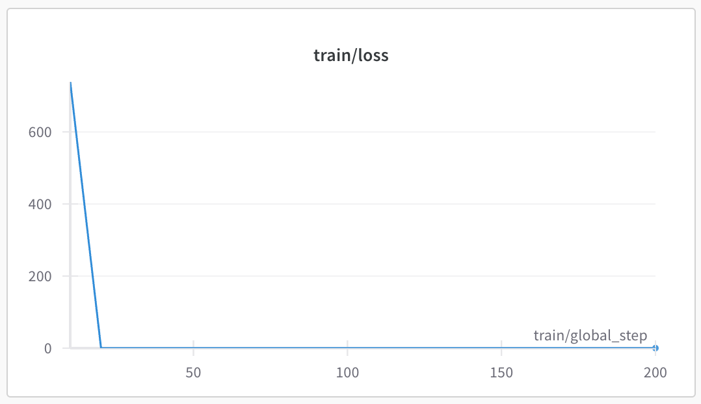
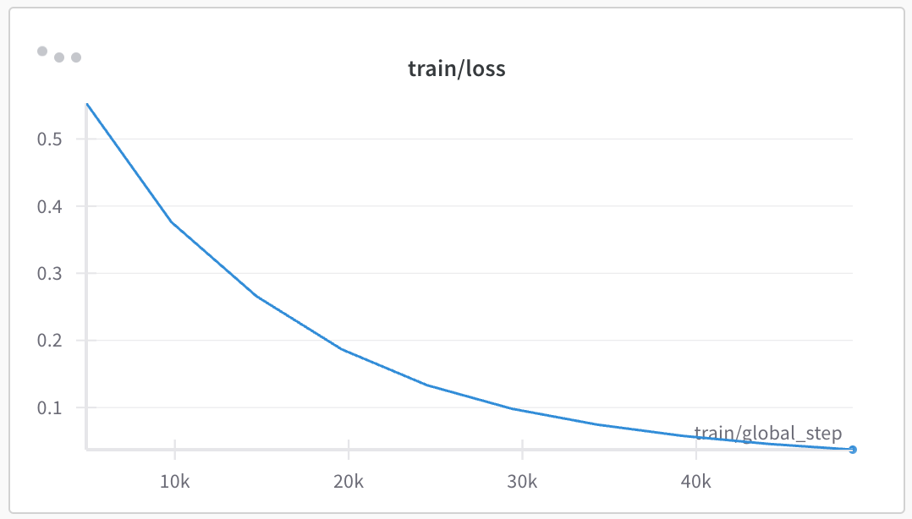
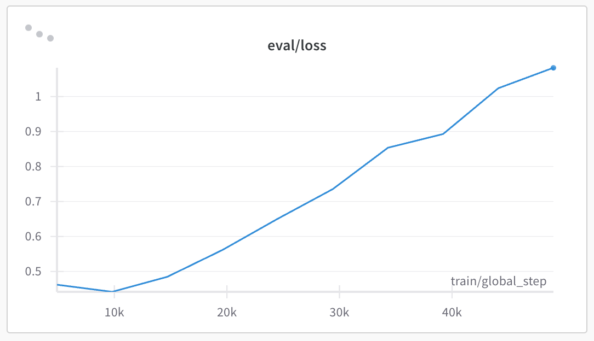

# [7주차] 기본과제: Validation data를 포함하여 Fine-tuning 해보기

## 수행 내용

[코드](w7_1_train.ipynb)

- 데이터셋: [KoAlpaca-v1.1a](https://huggingface.co/datasets/beomi/KoAlpaca-v1.1a)
- 사용한 모델들: 
    - [KoRWKV-1.5B](https://huggingface.co/beomi/KoRWKV-1.5B)
    - [KoAlpaca-v1.1a](https://huggingface.co/datasets/beomi/KoAlpaca-v1.1a)
    - [gpt2](https://huggingface.co/openai-community/gpt2)
    - [opt-125m](https://huggingface.co/facebook/opt-125m)
    - [gemma-2-2b](https://huggingface.co/google/gemma-2-2b)

## 결과

모든 모델들이 20 step부터 loss가 0이 되어버려서, 학습 정도를 확인할 수 없었음.
evaluation 과정에서는 시스템 RAM 초과로 세션이 중지됨.

[wandb log](https://wandb.ai/teacher-ssamko-familywave/Hanghae99/runs/7vw33s4o?nw=nwuserteacherssamko&panelDisplayName=train%2Floss&panelSectionName=train)

## wandb log

아래 로그는 4주차에 mnli 데이터셋 학습시 사용했던 로그.

[train loss](https://wandb.ai/teacher-ssamko-familywave/huggingface/runs/8usvrmij?nw=nwuserteacherssamko&panelDisplayName=train%2Floss&panelSectionName=train)

[eval loss](https://wandb.ai/teacher-ssamko-familywave/huggingface/runs/8usvrmij?nw=nwuserteacherssamko&panelDisplayName=eval%2Floss&panelSectionName=eval)

